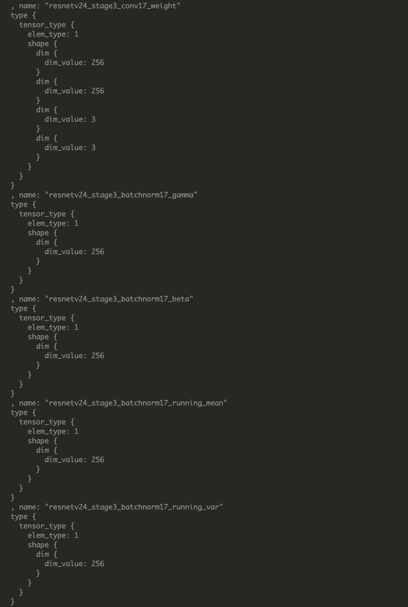
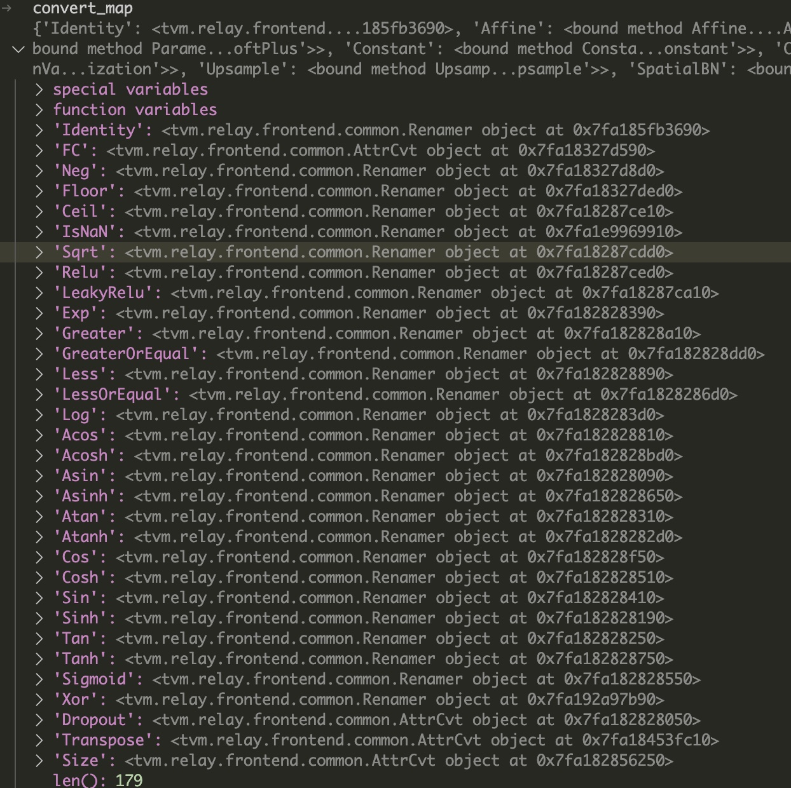

ONNX规范由以下几个部分组成：

- 可扩展的计算图模型：定义了通用的计算图IR
- 内置opset：ai.onnx和ai.onnx.ml，ai.onnx是默认的操作符集，主要针对神经网络模型，ai.onnx.ml主要适用于传统非神经网络机器学习模型。
- 标准数据类型。包括张量（tensors）、序列（sequences）和映射（maps）。

ONNX使用protobuf序列化AI模型
顶层是一个模型（Model）结构，主要由关联的元数据和一个图（Graph）组成；-> 
图由元数据、模型参数、输入输出、和计算节点（Node）序列组成，这些节点构成了一个计算无环图 -> 
每一个计算节点代表了一次操作符的调用，由节点名称、操作符、输入列表、输出列表和属性列表组成 ->
属性列表主要记录了一些运行时常量，比如模型训练时生成的系数值。

- **ModelProto**：加载了一个onnx模型之后获得的就是一个ModelProto，它包含了一些版本信息，生产者信息和一个GraphProto。
- **GraphProto**：在GraphProto里面又包含了四个repeated数组，它们分别是node(NodeProto类型)，input(ValueInfoProto类型)，output(ValueInfoProto类型)和initializer(TensorProto类型)；
- **NodeProto**：网络节点数据类型。GraphProto使用一个NodeProto数组记录网络的所有节点。每个节点都会有两个string类型的数组：input和output，表示当前节点的输入数据的源节点和输出数据的目的节点。通过input和output的指向关系来构建出一个深度学习模型的网络结构
- **ValueInfoProto**：GraphProto中有两个ValueInfoProto类型的数组：input和output，分别存放网络的输入输出；
- **TensorProto**：张量类型。GraphProto中定义了一个该类型的数组：initializer，用于存放网络的常量输入，也就是模型的权重参数。数组中的所有张量必须是有名字的。并且这些张量名字也出现在前述的input数组中。
- **AttributeProto**：网络节点（NodeProto类型）的属性类型，用来描述该节点的属性信息，比如Conv节点或者说卷积层的属性包含group，pad，strides等等。

这里要注意一下， GraphProto中的input数组不仅包含我们一般理解中的图片输入的那个节点，还包含了模型中所有的权重。例如，Conv层里面的权重实体是保存在initializer中的，相应的会有一个同名的元素在input中。背后的逻辑应该是把权重也看成模型的输入，并通过initializer中的权重实体来对这个输入做初始化。 

```python
shape_dict = {input_name: img_data.shape}
mod, params = relay.frontend.from_onnx(onnx_model, shape_dict)
```

这里生成一个TVM的``GraphProto``实例g, 然后将传入的onnx模型graph传入GraphProto的``from_onnx``方法。

```python
def from_onnx(
    model, shape=None, dtype="float32", opset=None, freeze_params=True, convert_config=None
):
    ...
    g = GraphProto(shape, dtype, freeze_params)
    graph = model.graph
    ...
    with g:
        mod, params = g.from_onnx(graph, opset)

    if freeze_params:
        mod = relay.transform.DynamicToStatic()(mod)

    return mod, params
```

GraphProto.from_onnx的参数有onnx模型的TVM GraphProto实例、版本信息、和转换结果返回方式配置：如果设置为true，则只打印onnx模型转为tvm后的表示；默认为false，将返回onnx模型的TVM中间表示数据mod(tvm.IRModule类型)和参数params

```python
 def from_onnx(self, graph, opset, get_output_expr=False):
        """Construct Relay expression from ONNX graph.

        Onnx graph is a python protobuf object.
        The companion parameters will be handled automatically.
        However, the input names from onnx graph is vague, mixing inputs and
        network weights/bias such as "1", "2"...
        For convenience, we rename the `real` input names to "input_0",
        "input_1"... And renaming parameters to "param_0", "param_1"...

        Parameters
        ----------
        graph : onnx protobuf object
            The loaded onnx graph

        opset : opset version

        get_output_expr: bool
            If set to true, this conversion will return each output expression rather
            than a packaged module. This can be useful when converting subgraphs to
            relay.

        Returns
        -------
        mod : tvm.IRModule
            The returned relay module

        params : dict
            A dict of name: tvm.nd.array pairs, used as pretrained weights
        """
        self.opset = opset
        self._parse_graph_initializers(graph)
        self._parse_graph_input(graph)
        self._check_user_inputs_in_outermost_graph_scope()
        self._check_for_unsupported_ops(graph)
        self._construct_nodes(graph)

        # now return the outputs
        outputs = [self._nodes[self._parse_value_proto(i)] for i in graph.output]
        outputs = outputs[0] if len(outputs) == 1 else _expr.Tuple(outputs)
        # If requested, directly return the converted expressions.
        if get_output_expr:
            return outputs
        ## Maintain the order of inputs and parameters from the ONNX graph, but only include
        ## those parameters that are needed to execute the relay graph
        free_vars = analysis.free_vars(outputs)
        nodes = {v: k for k, v in self._nodes.items()}
        free_vars = [nodes[var] for var in free_vars]
        for i_name in self._params:
            if i_name in free_vars and i_name not in self._inputs:
                self._inputs[i_name] = self._nodes[i_name]
        # Create a function from our output expression and all input variables.
        func = _function.Function([v for k, v in self._inputs.items()], outputs)
        return IRModule.from_expr(func), self._params
```

from_onnx中，首先调用_parse_graph_initializers从onnx模型的initializer数据段中解析转换网络权重数据：
initializer中的张量必须是有名字的，所以这里对每个元素都判断是否有名字，如果名字字段为空，则认为网络不合法

```python
def _parse_graph_initializers(self, graph):
    """Parse network inputs to relay, aka parameters."""
    # onnx中的initializer存储了模型中每个节点的权重信息
    for init_tensor in graph.initializer:
        # init_tensor.name是权重张量的名字
        # 例如网络中某个卷积权重参数名字为x1
        # graph.initializer中就有对应节点，名字为x1
        if not init_tensor.name.strip():
            raise ValueError("Tensor's name is required.")
        # 将权重矩阵转化为tvm的nD-array
        array = self._parse_array(init_tensor)
        if self._freeze_params:
            # 如果设置了freeze_params则设置为常量节点
            self._nodes[init_tensor.name] = _expr.const(array)
        else:
            # 将解析的参数记录到参数表中
            self._params[init_tensor.name] = array
            # 在节点表中新增一个节点，记录参数
            self._nodes[init_tensor.name] = new_var(
                init_tensor.name,
                shape=self._params[init_tensor.name].shape,
                dtype=self._params[init_tensor.name].dtype,
            )
```

GraphProto中的input数组不仅包含模型的输入，还包含了模型中各节点的权重。也就是将网络的输入节点和各网络节点的权重参数都当作输入

图片里后面跟的数字都是变化的，相同类型但是具有不同参数的节点有很多个

```python
def _parse_graph_input(self, graph):
    for i in graph.input:
        # from onnx v0.2, GraphProto.input has type ValueInfoProto,
        #  and the name is 'i.name'
        # graph.input 具体可以看图片里面，看看名字长什么样子
        i_name, i_shape, d_type, i_shape_name = get_info(i)
        if i_name in self._params:
            # i is a param instead of input
            # 前面initializer获取到了名字，名字就是两者之间的“主键”
            # todo
            # 奇怪的是之前_parse_graph_initializers中也有这个逻辑，两者做的事情似乎是相同的
            # 答案：这是一系列if elif else，已经存在了就不会进行处理了
            self._num_param += 1
            self._nodes[i_name] = new_var(
                i_name, shape=self._params[i_name].shape, dtype=self._params[i_name].dtype
            )
        elif i_name in self._nodes:
            continue
        else:
            # 如果是模型的输入
            self._num_input += 1
            self._input_names.append(i_name)
            # self._shape 是用户在调用from_onnx时传入的模型的shape参数
            if i_name in self._shape:
                i_shape = self._shape[i_name]
            else:
                # 输入的模型中有不定项
                if "?" in str(i_shape):
                    warning_msg = (
                        "Input %s has unknown dimension shapes: %s. "
                        "Specifying static values may improve performance"
                        % (i_name, str(i_shape_name))
                    )
                    warnings.warn(warning_msg)
            if isinstance(self._dtype, dict):
                dtype = self._dtype[i_name] if i_name in self._dtype else d_type
            else:
                dtype = d_type
            # 在node表中加入输入节点
            self._nodes[i_name] = new_var(i_name, shape=i_shape, dtype=dtype)
        # 记录模型的输入node
        self._inputs[i_name] = self._nodes[i_name]
```

调用_check_for_unsupported_ops检查当前的onnx网络中所有算子是不是都能转换为tvm relay ir 
convert_map


```python
def _check_for_unsupported_ops(self, graph):
    # 获取onnx算子到 tvm relay ir 的映射表
    # self.opset是一个数字。数字似乎是版本信息，算子有多个版本
    convert_map = _get_convert_map(self.opset)
    unsupported_ops = set()
    for node in graph.node:
        op_name = node.op_type
        # 添加到不支持列表
        if (
            op_name not in convert_map
            and op_name != "Constant"
            and op_name not in _identity_list
        ):
            unsupported_ops.add(op_name)
    # 报错
    if unsupported_ops:
        msg = "The following operators are not supported for frontend ONNX: "
        msg += ", ".join(unsupported_ops)
        raise tvm.error.OpNotImplemented(msg)
```

然后调用_construct_nodes函数，解析onnx网络的各个节点以及节点连接关系，在tvm中创建网络的DAG（有向无环图） 

```python
def _construct_nodes(self, graph):
        """Nodes are stored as directed acyclic graph."""
        # 遍历onnx模型的每一个节点
        for node in graph.node:
            # 算子名称不是节点名称
            op_name = node.op_type
            # 解析节点属性
            attr = self._parse_attr(node.attribute)
            # Create and populate input list.
            inputs = onnx_input()
            # 获取节点的所有输入
            for i in node.input:
                if i != "":
                    inputs.append(self._nodes[self._renames.get(i, i)])
                else:
                    inputs.append(None)
            i_name = self._parse_value_proto(node)
            node_output = self._fix_outputs(op_name, node.output)
            attr["tvm_custom"] = {}
            attr["tvm_custom"]["name"] = i_name
            attr["tvm_custom"]["num_outputs"] = len(node_output)

            op = self._convert_operator(op_name, inputs, attr, self.opset)
            if not isinstance(op, _expr.TupleWrapper):
                outputs_num = 1
            else:
                outputs_num = len(op)

            if outputs_num == 1:
                op = fold_constant(op)
            else:
                op = _expr.TupleWrapper(fold_constant(op.astuple()), len(op))

            if outputs_num > 1:
                # ONNX supports optional outputs for some nodes.
                # This block searches for missing outputs in the ONNX graph
                # and removes any unneeded ops
                valid_outputs = [False] * outputs_num
                for i, output in enumerate(node_output):
                    if output != "":
                        valid_outputs[i] = True
                # If we have outputs ONNX isn't expecting, we need to drop them
                if not all(valid_outputs):
                    tup = op.astuple()
                    # TupleWrapper can also wrap ops with TupleType outputs
                    if isinstance(tup, _expr.Tuple):
                        # For tuples, we extract the fields instead of using GetTupleItem
                        outputs = [tup.fields[i] for i, valid in enumerate(valid_outputs) if valid]
                    else:
                        # For call nodes, we need to GetTupleItem
                        outputs = [op[i] for i, valid in enumerate(valid_outputs) if valid]
                    # Create the new op with valid outputs
                    if len(outputs) == 1:
                        op = outputs[0]
                    elif len(outputs) != outputs_num:
                        op = _expr.TupleWrapper(_expr.Tuple(outputs), len(outputs))
                    # Drop invalid outputs for the onnx node
                    outputs_num = len(outputs)
                    node_output = [output for output in node_output if output != ""]
            assert (
                len(node_output) == outputs_num
            ), "Number of output mismatch {} vs {} in {}.".format(
                len(node_output), outputs_num, op_name
            )

            if outputs_num == 1:
                self._nodes[node_output[0]] = op
            else:
                for k, i in zip(list(node_output), range(len(node_output))):
                    self._nodes[k] = op[i]
```
