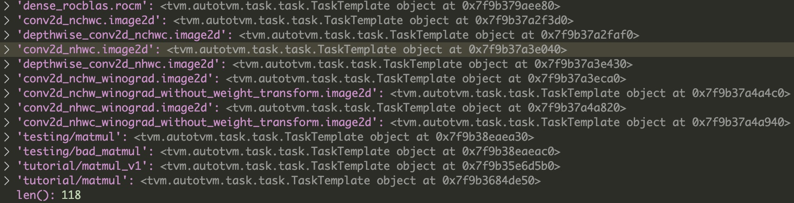

之前使用tvm的次数也比较多了，但是始终不是很清楚调优过程中产生的.log文件中具体是什么信息

首先探究使用autotvm进行单个算子调优的情况。以这个[文件](https://github.com/l1nkr/tvm_tutorial/blob/main/user_tutorial/Optimizing_Operators_with_Schedule_Templates_and_AutoTVM/autotvm.py)为例子

### 总体的逻辑

1. 定义一个`template`，这里面指定了调度空间
2. 将`template`包装为一个`task`
3. 指定`measure_option`，用于调优的时候测定算子的性能
4. 使用`task`初始化一个`tuner`
5. 使用`tuner`进行调优
6. 使用`apply_history_best`从调优日志中获取最好的配置
7. 进行编译`tvm.build`

### 定义template

由于使用的是`autotvm`，所以需要我们自己定义调优模版`tutorial/matmul`

```python
@autotvm.template("tutorial/matmul")
def matmul(N, L, M, dtype):
    ...
    C = te.compute((N, M), lambda i, j: te.sum(A[i, k] * B[k, j], axis=k), name="C")
    s = te.create_schedule(C.op)
    ...
    #### define space begin
    # Query the context to get the specific config for a template.
    # If cannot find the result inside this context, this function will query it
    # from the upper contexts.
    cfg = autotvm.get_config()

    # num_outputs : the total number of axis after split (`int`).
    cfg.define_split("tile_y", y, num_outputs=2)
    cfg.define_split("tile_x", x, num_outputs=2)
    #### define space end

    # 依据config将轴进行拆分
    # 但是这里并没有指定按什么比例进行拆分，这也就是我们的knob
    yo, yi = cfg["tile_y"].apply(s, C, y)
    xo, xi = cfg["tile_x"].apply(s, C, x)
    # 调换循环的顺序
    s[C].reorder(yo, xo, k, yi, xi)

    return s, [A, B, C]
```

关于`cfg = autotvm.get_config()`是如何执行的，可以见下面函数：

```python
def get_config():
    """Get current config object

    Returns
    -------
    cfg: ConfigSpace or ConfigEntity
        The current config
    """
    # 在我调试的时候 tgt 为 llvm -keys=cpu
    tgt = Target.current(allow_none=True)
    # query函数如下，为template找到一个具体的config
    return DispatchContext.current.query(tgt, None)

def query(self, target, workload):
    """
    Query the context to get the specific config for a template.
    If cannot find the result inside this context, this function will query it
    from the upper contexts.

    Parameters
    ----------
    target: Target
        The current target
    workload : Workload
        The current workload.

    Returns
    -------
    cfg : ConfigSpace
        The specific configuration.
    """
    # 这里结果是在`task = autotvm.task.create("tutorial/matmul", args=(N, L, M, "float32"), target="llvm")`
    # 里面ApplyConfig()得到的
    ret = self._query_inside(target, workload)
    if ret is None:
        ret = self._old_ctx.query(target, workload)
    return ret
```

### 生成task

依据这个模版生成一个`task`

```python
task = autotvm.task.create("tutorial/matmul", args=(N, L, M, "float32"), target="llvm")
```

```python
def create(task_name, args, target, target_host=None):
    """Create a tuning task and initialize its search space

    Parameters
    ----------
    task_name : str
        The AutoTVM task name
    args : List
        Positional arguments
    target : Target
        The compilation target
    target_host: Target, optional
        The compilation target for host side

    Returns
    -------
    tsk: Task
        a task object
    """
    ...
    ret = Task(task_name, args)
    ...
    # The configuration space of a schedule. Pass it as config in template to
    # collect transformation space and build transform graph of axes

    ret.config_space = ConfigSpace()
    ctx = ApplyConfig(ret.config_space)
    with ctx:
        with target:
            # 这里的ret.func()就是我们自己定义的tutorial/matmul模版
            # 这里的sch就是s=te.create_schedule()返回的
            sch, _ = ret.func(*args)
            ret.config_space.code_hash = getattr(sch, "code_hash", None)
    # Calculate number of FLOP (floating number operations) of the compute ops in a schedule
    ret.flop = ret.config_space.flop or compute_flop(sch)
    ...
    return ret
```

```python
class Task(object):
    """A unable Task
    """
    def __init__(self, name, args):
        self.name = name
        self.args = args
        ...
        self.func = _lookup_task(name)
        ...

_lookup_task这个函数会依据名字，寻找算子对应的模版。
这里的模版可以是我们自己定义的模版（如tutorial/matmul），也可以是预定义的模版
def _lookup_task(name):
    task = TASK_TABLE.get(name)
    if task is None:
        # Unable to find the given task. This might be because we are
        # creating a task based on a name that has not been imported.
        # Rather than raising an exception here, we return a dummy
        # task which cannot be invoked.
        task = MissingTask(name)
    return task
```



### 指定measure_option
```python
# 指定在哪里进行build
# 在哪里运行获取实际性能
measure_option = autotvm.measure_option(builder="local", runner=autotvm.LocalRunner(number=5))
```
### 初始化tuner
```python
tuner = autotvm.tuner.RandomTuner(task)
```
### tune以及apply_history_best
```python
tuner.tune(
    n_trial=50,
    measure_option=measure_option,
    callbacks=[autotvm.callback.log_to_file("matmul.log")],
)

with autotvm.apply_history_best("matmul.log"):
    with tvm.target.Target("llvm"):
        s, arg_bufs = matmul(N, L, M, "float32")
        func = tvm.build(s, arg_bufs)

```
详情[参考](./read_code.md#autotvm执行过程)

最后得到的log格式
result: MeasureResult(costs=(0.0120379658,), error_no=MeasureErrorNo.NO_ERROR, all_cost=0.6942737102508545, timestamp=1672653690.186004)