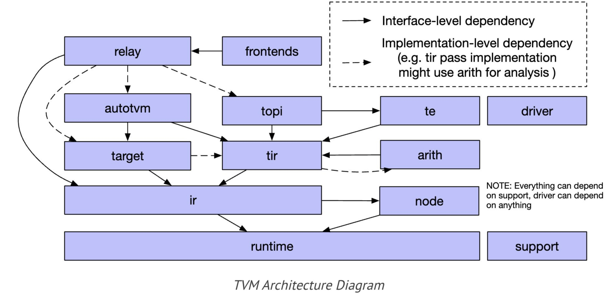

## 源码分析

### 框架图



### torch前端到tvm.IRModule
```
调用流程：relay.frontend.from_pytorch
1 tvm.IRModule(初始化容器，用于保存relay的信息)
2 Prelude(加载辅助函数)
  2.1 import_from_std(加载基础函数)
  2.2 tensor_array_ops.register(加载tensorarray相关函数)
3 PyTorchOpConverter(构建converter，用于算子解析)
4 create inputs && params
  4.1 _get_relay_input_vars(构建inputs)
  4.2 convert_params(构建params)
5 converter.convert_operators(转换算子)
6 set the IRModule
  6.1 analysis.free_vars(确定无依赖参数，例如inputs，params)
  6.2 tvm.relay.Function(用Function包装DAG计算过程)
  6.3 transform.RemoveUnusedFunctions(简单优化去除无用代码)
```
[参考](https://zhuanlan.zhihu.com/p/457039705)

### Python调用C++机制

[这篇文章写得很好，说得很清楚](https://blog.csdn.net/zx_ros/article/details/122931616)

[参考](https://zhuanlan.zhihu.com/p/363991566)
### autotvm执行过程
```python
调用流程：
1 relay.frontend.from_pytorch(解析过程，略)
2 autotvm.task.extract_from_program(任务提取)
  2.1 _lower(收集task)
    2.1.1 optimize(优化过程，略)
    2.1.2 GraphExecutorCodegen.codegen
      2.1.2.1(调用链)->select_implementation
        2.1.2.1.1 get_valid_implementations(通过FTVMStrategy找到实现)
        2.1.2.1.2 fcompute -> register_topi_compute
          2.1.2.1.2.1 _register_task_compute(函数添加到TASK_TABLE中)
          2.1.2.1.2.2 TaskExtractEnv.add_task(添加task)
  2.2 create(填充task信息)
    2.2.1 ApplyConfig(config_space)(设定默认config，用于记录解空间) && Task.func -> fcompute && fschedule(记录所有可能解)
    2.2.2 compute_flop(计算flop)
3 Tuner.tune(寻找解)
  3.1 create_measure_batch(创建评估函数)
    3.1.1 LocalRunner.set_task(初始化runner)
      3.1.1.1 Tracker.__init__(创建Tracker监听消息)
        3.1.1.1.1 _tracker_server -> TrackerServerHandler
        3.1.1.1.2 TrackerServerHandler.run(开始监听IO)
          3.1.1.1.2.1 _on_event->TCPEventHandler.on_message(事件处理)
            3.1.1.1.2.1.1 _init_conn(验证链接)
            3.1.1.1.2.1.2 call_handler -> ret_value(处理并回复)
      3.1.1.2 Server.__init__(创建Server监听消息)
        3.1.1.2.1 PopenWorker._start(创建tvm/exec/popen_worker.py子进程处理消息)
        3.1.1.2.2 _popen_start_rpc_server -> PopenRPCServerState -> _listen_loop(绑定监听线程)
          3.1.1.2.2.1 _listen_loop -> setup tracker(绑定tracker)
      3.1.1.3 check_remote(创建临时client并检查链接)
        3.1.1.3.1 connect_tracker(和tracker进行初始信息交互)
        3.1.1.3.2 TrackerSession.request(构建client并初始化session)
          3.1.1.3.2.1 sendjson && recvjson(获取tracker保存的key)
          3.1.1.3.2.2 _ffi_api.Connect交互(remote和server信息交互)
          3.1.1.3.2.3 RPCEndpoint::InitRemoteSession && ServerLoop -> HandleUntilReturnEvent -> HandleNextEvent (构建Remote链接和信息处理Loop)
    3.1.2 LocalBuilder.set_task(初始化builder)
  3.2 next_batch(取下一批数据) && measure_batch(评估得到结果)
    3.2.1 LocalBuilder.build(构建可执行的函数内核)
      3.2.1.1 LocalExecutor.submit -> _WrappedBuildFunc.__call__ -> _build_func_common -> tvm.driver.build(构建内核)
    3.2.2 LocalRunner.run(执行内核得到结果)
      3.2.2.1 module_loader(加载内核)
        3.2.2.1.1 request_remote(RPC链接)
        3.2.2.1.2 RPCSession.upload(使用tvm.rpc.server.upload保存lib)
          3.2.2.1.2.1.client RPCClientSession.GetFunction -> RPCEndpoint::SysCallRemote(获取函数)
          3.2.2.1.2.1.server HandleUntilReturnEvent -> HandleSyscall -> LocalSession::GetFunction(获取注册的函数)
          3.2.2.1.2.2.client RPCClientSession::CallFunc -> RPCEndpoint::CallFunc(调用函数)
          3.2.2.1.2.2.server HandleUntilReturnEvent -> HandleNormalCallFunc -> LocalSession::CallFunc(执行函数)
        3.2.2.1.3 RPCSession.load_module(使用tvm.rpc.server.load_module加载lib)
      3.2.2.2 mod.time_evaluator
        3.2.2.2.1 runtime.RPCTimeEvaluator(获取包裹的测试函数)
      3.2.2.3 random_fill
        3.2.2.3.1 get_function(获取函数)
        3.2.2.3.2 nd.array(构建原始数据)
          3.2.2.3.2.1 empty -> NDArray::Empty -> RPCDevAllocDataWithScope(开辟内存)
          3.2.2.3.2.2 copyfrom -> TVMArrayCopyFromBytes -> HandleCopyToRemote && HandleSyscallStreamSync(拷贝并同步)
        3.2.2.3.3 random_fill.__call__ -> RandomEngine::RandomFill(随即填充数据)
      3.2.2.4 dev.sync -> RPCSession::StreamSync -> HandleSyscallStreamSync(设备同步)
      3.2.2.5 time_f.__call__ -> WrapTimeEvaluator(执行测试，多次平均)
```


GridSearchTuner 也是一种调优器。继承关系：GridSearchTuner -> IndexBaseTuner -> Tuner
发现继承的子类似乎都只有获取数据的逻辑，在进行调优的时候，实际上用的都是Tuner类中的tune方法，也就是说调优的逻辑是相同的，只是获取数据的方式不同，这点算是比较好理解。

在看代码的时候，发现xgboost的cost model似乎并没有被使用。经过和老师讨论，认为应该是在使用遗传算法进行搜索时使用了cost model

[参考](https://zhuanlan.zhihu.com/p/457722423)

### autotvm.apply_history_best()

在使用relay.build之前，通常都会有这么一句
```python
with autotvm.apply_history_best(log_file):
    print("Compile...")
    with tvm.transform.PassContext(opt_level=3):
        lib = relay.build(mod, target=target, params=params)
    evaluate_performance(lib, data_shape)
```

log_file 是之前 tune 得到的数据，~~我猜测这里应该是训练成本模型的地方~~ 似乎不是，他只是从里面选了一些数据出来
ApplyHistoryBest 在 init 时会调用 self.load(records)

接下来进入 PassContext()
```python
def __init__(
    self,
    opt_level=2,
    required_pass=None,
    disabled_pass=None,
    instruments=None,
    config=None,
):
    ...
    self.__init_handle_by_constructor__(
        _ffi_transform_api.PassContext, opt_level, required, disabled, instruments, config
    )
```


### Build

tvm.build针对单一算子
relay.build针对整个模型进行编译

#### Build with Relay

relay.build()函数会进入python/tvm/relay/build_module.py，首先判断有没有autotvm预先tune好记录，然后构造tophub_context
```python
if isinstance(autotvm.DispatchContext.current, autotvm.FallbackContext):
    tophub_context = autotvm.tophub.context(list(raw_targets))
else:
    tophub_context = autotvm.utils.EmptyContext()
```

在其内部构建了BuildModule之后，才跳转到BuildModule.build，然后返回BuildModule.__init__中的内容
```python
with tophub_context:
    bld_mod = BuildModule()
    graph_json, runtime_mod, params = bld_mod.build(
        some_args...
    )
```

```python
class BuildModule(object):
    """Build an IR module to run on TVM graph executor. This class is used
    to expose the `RelayBuildModule` APIs implemented in C++.
    """

    def __init__(self):
        # 将会进入c++层
        self.mod = _build_module._BuildModule()
        ...some init...
```

c++函数位于src/relay/backend/build_module.cc
```c++
runtime::Module RelayBuildCreate() {
  auto exec = make_object<RelayBuildModule>();
  return runtime::Module(exec);
}
TVM_REGISTER_GLOBAL("relay.build_module._BuildModule").set_body([](TVMArgs args, TVMRetValue* rv) {
  *rv = RelayBuildCreate();
});
```

这里注册了RelayBuildCreate，RelayBuildCreate下面还使用了PackedFunc做了一层封装
```c++
else if (name == "build") {
      return PackedFunc([sptr_to_self, this](TVMArgs args, TVMRetValue* rv) {
        ICHECK_EQ(args.num_args, 8);
        this->Build(args[0], args[1], args[2], args[3], args[4], args[5], args[6], args[7]);
      });
```

调用的this->Build会再去调用BuildRelay
```c++
void Build(IRModule mod, const Array<Target>& raw_targets, const tvm::Target& target_host,
            const Executor& executor, const Runtime& runtime,
            const WorkspaceMemoryPools& workspace_memory_pools,
            const ConstantMemoryPools& constant_memory_pools, const String mod_name) {
    
    ...
    
    BuildRelay(std::move(mod), mod_name);
    }
```
```c++
void BuildRelay(IRModule relay_module, const String& mod_name) {
    // Relay IRModule -> IRModule optimizations.
    IRModule module = WithAttrs(
        relay_module, {{tvm::attr::kExecutor, executor_}, {tvm::attr::kRuntime, runtime_}});
    relay_module = OptimizeImpl(std::move(module));

    // Get the updated function and new IRModule to build.
    // Instead of recreating the IRModule, we should look at the differences between this and the
    // incoming IRModule to see if we can just pass (IRModule, Function) to the code generator.
    Function func = Downcast<Function>(relay_module->Lookup("main"));
    IRModule func_module = WithAttrs(IRModule::FromExpr(func),
                                     {{tvm::attr::kExecutor, executor_},
                                      {tvm::attr::kRuntime, runtime_},
                                      {tvm::attr::kWorkspaceMemoryPools, workspace_memory_pools_},
                                      {tvm::attr::kConstantMemoryPools, constant_memory_pools_}});
    ...
}
```

在 build_module.py 中还会调用 bld_mod.build()函数
```python
bld_mod = BuildModule()
graph_json, runtime_mod, params = bld_mod.build(
    mod=ir_mod,
    target=raw_targets,
    params=params,
    executor=executor,
    runtime=runtime,
    workspace_memory_pools=workspace_memory_pools,
    constant_memory_pools=constant_memory_pools,
    mod_name=mod_name,
)
```

bld_mod.build()函数往下走会调用 self._build() 函数。
**在里面还有一个发现，居然有一个 meta_schedule 选项，不知道是不是之前说的那个 meta schedule**
```python
self._build(
    mod,
    target,
    target_host,
    executor,
    runtime,
    workspace_memory_pools,
    constant_memory_pools,
    mod_name,
)
```


经过多番跳转，终于到达build的核心模块，再来看TVM逐步做的工作

1. 优化
设备无关的优化
```c++
// BuildRelay 中的 relay_module = OptimizeImpl(std::move(module));
IRModule OptimizeImpl(IRModule relay_module) {
    ICHECK(relay_module.defined()) << "The IRModule must be defined for the Relay compiler.";

    backend::BindParamsInModule(relay_module, params_);

    Array<Pass> pass_seqs =
        GetPassPrefix(/*is_homogenous=*/config_->primitive_targets.size() == 1, /*is_vm=*/false);
    transform::PassContext pass_ctx = PassContext::Current();

    if (config_->optional_homogeneous_target.defined()) {
      // This pass currently only supports the homogeneous case.
      pass_seqs.push_back(transform::SplitArgs(
          config_->optional_homogeneous_target->GetAttr<Integer>("max_function_args", -1)
              .value()
              .IntValue()));
    }

    // Always plan devices so the remaining passes don't need to distinguish homogeneous vs
    // hetrogenous execution.
    pass_seqs.push_back(transform::PlanDevices(config_));

    // Fuse the operations if it is needed.
    pass_seqs.push_back(transform::FuseOps());

    // Create a sequential pass and perform optimizations.
    transform::Pass seq = transform::Sequential(pass_seqs);
    if (config_->optional_homogeneous_target.defined()) {
      With<Target> tctx(config_->optional_homogeneous_target);
      relay_module = seq(relay_module);
    } else {
      relay_module = seq(relay_module);
    }

    // Do layout rewrite for auto-scheduler.
    if (backend::IsAutoSchedulerEnabled() && config_->optional_homogeneous_target.defined()) {
      Pass major_pass = transform::AutoSchedulerLayoutRewrite();
      bool enable_layout_rewrite_targets =
          config_->optional_homogeneous_target->kind->device_type == kDLCPU ||
          config_->optional_homogeneous_target->GetAttr<String>("device", "") == "mali";
      if (enable_layout_rewrite_targets && pass_ctx.PassEnabled(major_pass->Info())) {
        With<Target> tctx(config_->optional_homogeneous_target);
        relay_module = major_pass(relay_module);
        // Defuse ops to fold constants, then fuse them again
        relay_module = transform::DefuseOps()(relay_module);
        relay_module = transform::FoldConstant()(relay_module);
        relay_module = transform::FuseOps()(relay_module);
      }
    }
    if (backend::IsMetaScheduleEnabled() && config_->optional_homogeneous_target.defined()) {
      Pass major_pass = transform::MetaScheduleLayoutRewrite();
      bool enable_layout_rewrite_targets =
          config_->optional_homogeneous_target->kind->device_type == kDLCPU ||
          config_->optional_homogeneous_target->GetAttr<String>("device", "") == "mali";
      if (enable_layout_rewrite_targets && pass_ctx.PassEnabled(major_pass->Info())) {
        With<Target> tctx(config_->optional_homogeneous_target);
        relay_module = major_pass(relay_module);
        // Defuse ops to fold constants, then fuse them again
        relay_module = transform::DefuseOps()(relay_module);
        relay_module = transform::FoldConstant()(relay_module);
        relay_module = transform::FuseOps()(relay_module);
      }
    }

    relay_module = transform::InferType()(relay_module);

    // Inline the functions that have been lifted by the module scope.
    //
    // TODO(@zhiics) Note that we need to be careful about the subgraphs with
    // global function calls. We should make sure that these callees are also
    // inline functions. However, this should be very unlikely for accelerators
    // and vendor-provided libraries. So we don't handle for now.
    relay_module = transform::Inline()(relay_module);
    relay_module = transform::InferType()(relay_module);
    relay_module = transform::LabelOps()(relay_module);
    relay_module = transform::AnnotateMemoryScope(config_)(relay_module);

    ICHECK(relay_module.defined());

    return relay_module;
  }
```

2. 计算图生成

python 的 build_module.py 中有
```python
elif executor.name == "graph":
    executor_factory = _executor_factory.GraphExecutorFactoryModule(
        ir_mod,
        raw_targets,
        executor,
        graph_json,
        runtime_mod,
        mod_name,
        params,
        func_metadata,
    )
```

进入到 GraphExecutorFactoryModule 中
```python
def __init__(
    self,
    ir_mod,
    target,
    executor,
    graph_json_str,
    libmod,
    libmod_name,
    params,
    function_metadata,
):
    assert isinstance(graph_json_str, string_types)
    fcreate = get_global_func("tvm.graph_executor_factory.create")
    ...
    self.module = fcreate(graph_json_str, libmod, libmod_name, *args)
    ...
```

在 src/runtime/graph_executor/graph_executor_factory.cc 中注册这个函数
```python
TVM_REGISTER_GLOBAL("tvm.graph_executor_factory.create")
    .set_body([](TVMArgs args, TVMRetValue* rv) {
      ICHECK_GE(args.num_args, 3) << "The expected number of arguments for "
                                     "graph_executor_factory.create needs at least 3, "
                                     "but it has "
                                  << args.num_args;
      // The argument order is graph_json, module, module_name, param0_name, param0_tensor,
      // [param1_name, param1_tensor], ...
      ICHECK_EQ((args.size() - 3) % 2, 0);
      std::unordered_map<std::string, tvm::runtime::NDArray> params;
      // 参数不止这些，利用map存多个参数
      for (size_t i = 3; i < static_cast<size_t>(args.size()); i += 2) {
        std::string name = args[i].operator String();
        params[name] = args[i + 1].operator tvm::runtime::NDArray();
      }
      auto exec = make_object<GraphExecutorFactory>(args[0], params, args[2]);
      exec->Import(args[1]);
      *rv = Module(exec);
    });
```

下面似乎是仅仅构造了出来，没有看到调用图优化的函数
```python
GraphExecutorFactory::GraphExecutorFactory(
    const std::string& graph_json,
    const std::unordered_map<std::string, tvm::runtime::NDArray>& params,
    const std::string& module_name) {
  graph_json_ = graph_json;
  params_ = params;
  module_name_ = module_name;
}
```